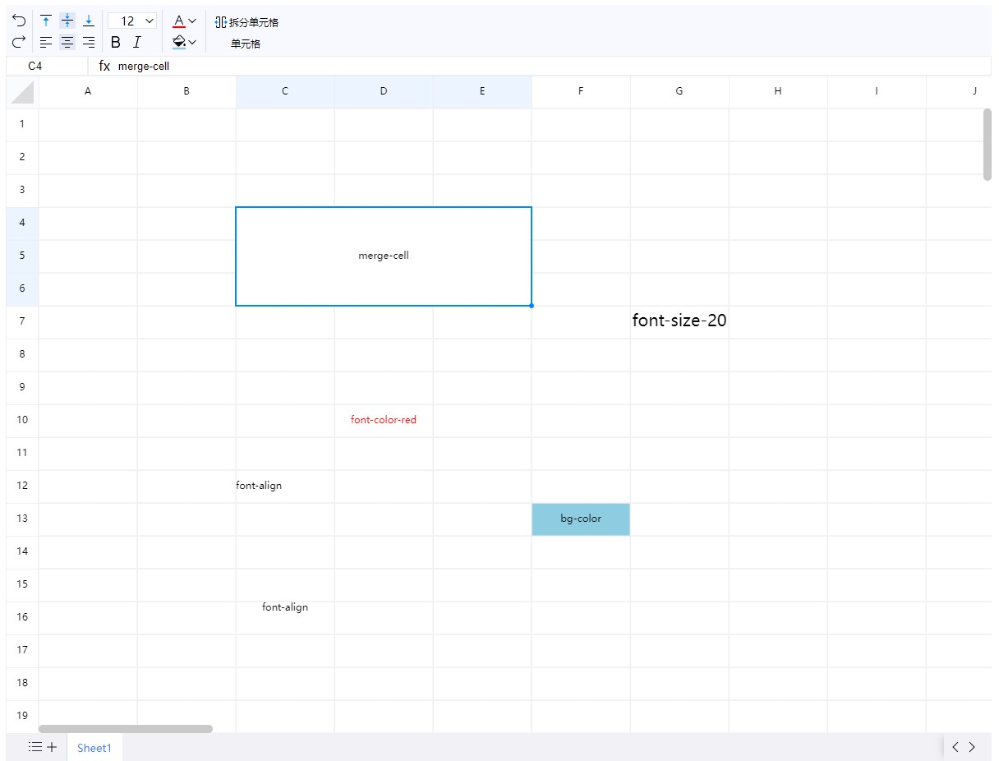

<p align="center">
	
</p>
<h1 align="center" style="margin: 0 0 20px; font-weight: bold;">e-sheet</h1>
<h4 align="center">web excel</h4>

<p align="center">
    <a href="https://github.com/lyqgit/e-sheet/tree/main/README.md">English</a>&nbsp;&nbsp;
    <a href="https://github.com/lyqgit/e-sheet/tree/main/README.zh-hans.md">简体中文</a>&nbsp;&nbsp;
</p>

## introduction

* using Canvas to draw Excel tables, supporting some basic table operation functions, and supporting copying and pasting data with Alibaba in Excel documents and WPS



## preview

<p>
    <a href="https://lyqgit.github.io">https://lyqgit.github.io</a>
</p>

## install

```

npm i e-sheet

```

## use

```

// es

import eSheet from 'e-sheet'
import 'e-sheet/dist/css/index.css'

const excel = new eSheet('#elt',{
    width:1200,
    height:800
})


// umd

<link rel="stylesheet" href="dist/css/index.css">
<script lang="javascript" src="dist/e-sheet.umd.js"></script>

const excel = new eSheet('#elt',{
    width:1200,
    height:800
})

```

## collaborative services

```

cd ./server/multi-person-collaboration

cargo run

```

## api

|    ability    |      function      |                              example                               |
|:-------------:|:------------------:|:------------------------------------------------------------------:|
|    export     |   exportXlsxData   | [{label:"sheet1",sheet:{!ref:"D10",D10:{t:"s",v:"test content"}}}] |
| step callback | stepCallbackHandle |         excel.stepCallbackHandle((obj)=>{console.log(obj))         |
|   fresh all   |       fresh        |                                void                                |
| fresh content |    freshContent    |                                void                                |

## function

- [x] single choice
- [x] multiple choice
- [x] copy
- [x] paste
- [x] painter
- [x] merge
- [x] split
- [x] drag
- [x] add row
- [x] add col
- [x] font-family
- [x] font-color
- [x] background-color
- [x] horizontal-alignment
- [x] vertical-alignment
- [x] export-data
- [ ] import-data
- [x] forward
- [x] fallback