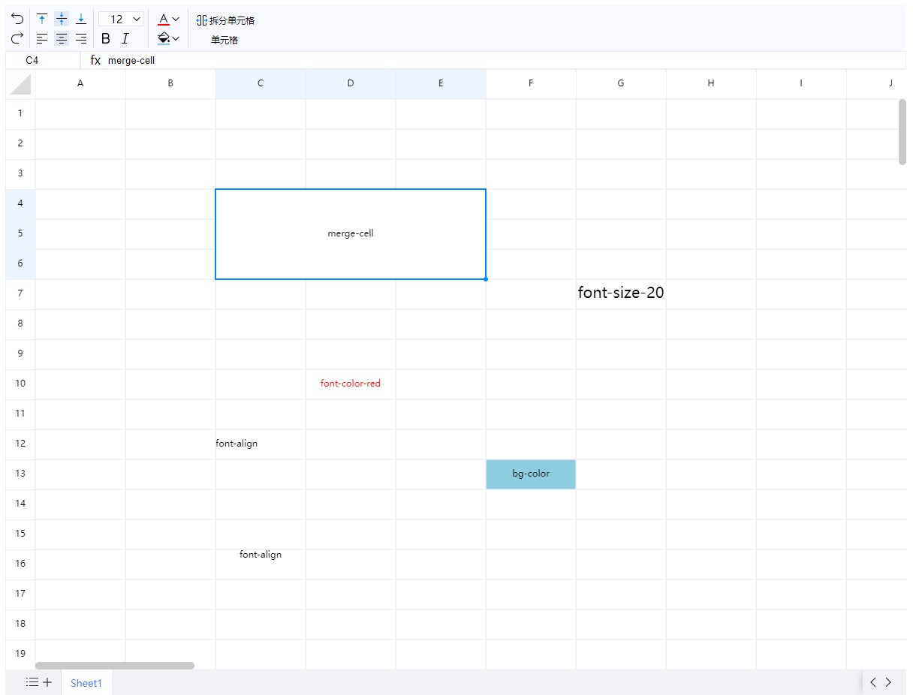

<p align="center">
	
</p>
<h1 align="center" style="margin: 0 0 20px; font-weight: bold;">e-sheet</h1>
<h4 align="center">网页版excel</h4>

<p align="center">
    <a href="https://github.com/lyqgit/e-sheet/tree/main/README.md">English</a>&nbsp;&nbsp;
    <a href="https://github.com/lyqgit/e-sheet/tree/main/README.zh-hans.md">简体中文</a>&nbsp;&nbsp;
</p>

## 简介

* 使用canvas绘制excel表格，支持部分基础的表格操作功能，可支持和阿里在excel文档和wps互相复制粘贴数据



## 预览

<p>
    <a href="https://lyqgit.github.io">https://lyqgit.github.io</a>
</p>

## 安装

```

npm i e-sheet

```

## 使用

```

// es

import eSheet from 'e-sheet'
import 'e-sheet/dist/css/index.css'

const excel = new eSheet('#elt',{
    width:1200,
    height:800
})


// umd

<link rel="stylesheet" href="dist/css/index.css">
<script lang="javascript" src="dist/e-sheet.umd.js"></script>

const excel = new eSheet('#elt',{
    width:1200,
    height:800
})

```

## 协同服务

```

cd ./server/multi-person-collaboration

cargo run

```

## api

|        函数名         |   功能   |    参数    |                             样例               |
|:------------------:|:------:|:--------:|:----------------------------------------------------------:|
|   exportXlsxData   |   导出   |    无     | [{label:"sheet1",sheet:{!ref:"D10",D10:{t:"s",v:"测试内容"}}}] |
| stepCallbackHandle |  操作回调  | callback |     excel.stepCallbackHandle((obj)=>{console.log(obj))     |
|       fresh        |  全部刷新  |    无     |                           void                            |
|    freshContent    | 刷新表格内容 |    无     |                           void                            |
|    connectWebSocket     |   链接websocket     | 链接地址addr |                           ws://192.168.31.208:8091                            |

## 功能

- [x] 单选
- [x] 多选
- [x] 复制
- [x] 粘贴
- [x] 右下角格式刷
- [x] 合并
- [x] 拆分
- [x] 拖拽
- [x] 添加行数
- [x] 添加列数
- [x] 字体
- [x] 文字颜色
- [x] 背景色
- [x] 文字水平对齐
- [x] 文字垂直对齐
- [x] 删除线
- [x] 下划线
- [x] 导出
- [ ] 导入
- [x] 前进
- [x] 后退